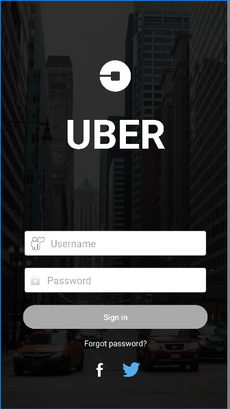

# 🚖 Uber Login UI – Android App

A **Uber-inspired Login Screen UI** built using **Kotlin** and **XML (ConstraintLayout)** for Android.  
This project focuses on **UI/UX design, input validation, and basic interaction handling**.

---

## 📱 Project Overview

This Android app replicates a **Uber-style login screen**, featuring:

- Background image with dark overlay
- Uber logo and app name
- Username and password input fields
- Sign In button
- "Forgot password?" text
- Social login icons (Facebook & Twitter)

⚠️ **Note:**  
This project is **for learning purposes only**.  
It **does NOT connect to Uber servers** and does **NOT perform real authentication**.

---

## ✨ Features

- 👤 Username input field
- 🔐 Password input field
- ✅ Basic input validation (empty field check)
- 📢 Toast messages for feedback
- 🎨 Uber-style UI with background overlay
- 📱 Responsive layout using ConstraintLayout
- 🔗 Social login icons for Facebook and Twitter (UI only)

---

## 📸 Screenshots

| Login Screen |
|-------------|
|  |
---

## 🛠️ Tech Stack

- **Language:** Kotlin  
- **UI:** XML (ConstraintLayout)  
- **IDE:** Android Studio  
- **Architecture:** Activity-based  
- **Design Focus:** Modern, minimal Uber-style login screen  

---

## 🧠 How It Works

### 🔹 Login Logic (MainActivity)

- Reads user input from EditText fields (username & password)
- Checks if input is empty
- Displays a **Toast message** for feedback

## 👤 Author

**Bilal Nazeer**  

---

## 📄 License

This project is for **educational and practice purposes only**.
